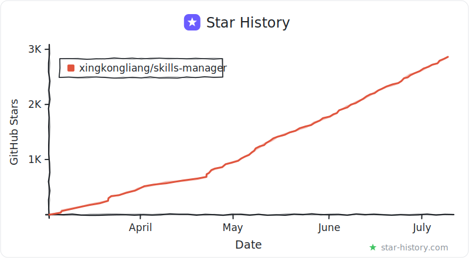

<p align="center">
  
</p>

<h1 align="center">Skills Manager</h1>

<p align="center">
  一个应用，统一管理所有 AI 编码工具的 Skills。
</p>

<p align="center">
  🎬 <a href="https://www.bilibili.com/video/BV1845F6REUu/">视频介绍（Bilibili）</a>
  &nbsp;·&nbsp;
  <a href="https://www.youtube.com/watch?v=wfbCrfNASVU">Video intro (YouTube)</a>
</p>

<p align="center">
  <a href="./README.md">English</a>
</p>

<p align="center">
  <a href="https://trendshift.io/repositories/23290?utm_source=repository-badge&amp;utm_medium=badge&amp;utm_campaign=badge-repository-23290" target="_blank" rel="noopener noreferrer"></a>
</p>

<p align="center">
  
</p>

<p align="center"><strong>安装 Skills</strong></p>
<p align="center"></p>

<p align="center"><strong>全局工作区</strong></p>
<p align="center"></p>

<p align="center"><strong>Agent 工作区</strong></p>
<p align="center"></p>

<p align="center"><strong>项目工作区</strong></p>
<p align="center"></p>

<p align="center"><strong>备份与多设备同步</strong></p>
<p align="center"></p>

<p align="center"><strong>设置</strong></p>
<p align="center"></p>

## 功能

- **统一技能库** — 从 Git 仓库、本地目录、`.zip` / `.skill` 文件或 [skills.sh](https://skills.sh) 市场安装技能，统一存放在 `~/.skills-manager`。
- **Preset（预设）** — 将技能分组为命名 Preset。在任意工作区点击 Preset 标签，即可一键为当前 Agent 范围激活或停用其全部技能，激活的 Preset 显示 ✓，部分安装显示数量。
- **全局工作区** — 每个 Agent 都有自己的页面，列出其全局目录里的所有 Skills（包括不是通过 Skills Manager 安装的），始终反映 Agent 实际看到的内容。可按 Agent 添加或移除 Skills，也可通过「全部 Agents」总览跨所有已安装 Agent 统一管理。
- **项目工作区** — 查看并管理任意项目的本地 Skills 目录，支持与中央库双向同步。支持嵌套 Skill 目录和导出时按 Agent 分配。
- **关联工作区** — 将任意目录指定为 Skills 根目录，适合管理不在默认 Agent 路径下的 Skills。作为独立工作区管理，不参与全局 Preset 同步。
- **多工具同步** — 一键将技能同步到任意支持的工具，支持软链接和复制两种模式。每张 Skill 卡片会为每个已启用 Agent 显示一个图标角标，点击角标即可直接在卡片上为该 Agent 安装或移除这个 Skill，角标会实时反映同步状态。
- **「添加 Skills」弹层** — 任意工作区点击 **+ 添加 Skills** 即可打开统一的挑选弹层：搜索中央库，用始终可见的 Agent 标签切换目标（含一键全选/清空），一次提交批量添加多个 Skills。
- **批量操作** — 多选技能后批量启用/禁用、导出或删除。项目工作区中的项目 Skills 也支持批量启用/禁用。
- **技能标签** — 为技能添加标签，用于归类同类技能，并按来源或标签筛选；新增的 **未标签** 过滤项可快速定位漏打标签的 Skills。
- **更新检查** — 为 Git 类技能检查远端更新；本地技能支持重新导入。
- **文档预览** — 直接在应用内查看 `SKILL.md` / `README.md`。
- **自定义工具** — 添加自定义 Agent/工具并指定 Skills 目录，也可覆盖内置工具的默认路径。
- **备份与多设备同步** — 一次 GitHub 登录（或任意 Git 远端）接入私有备份仓库，之后自动备份、多台设备自动保持一致。合并以技能为单位——一台改名、另一台改内容会自动组合；真冲突不阻塞不覆盖，本机版本保留待你三选一处理。快照版本随时可恢复。
- **活动日志 & 导出日志** — 应用会记录本地的安装/移除/更新/同步操作。在 **设置 → 导出日志** 可把最近日志和活动记录打包成压缩文件，方便提交 Issue 时附上。
- **灵活的应用设置** — 在一个页面里配置仓库路径、同步模式、主题、字号、语言、托盘行为、代理、Git 远程、更新检查，以及 Agent 在全应用中的显示顺序。

## 核心概念

- **Preset 是可复用的 Skills 分组** — Preset 是一组命名的 Skills 集合。在任意工作区激活 Preset，即可将其所有 Skills 添加到选定 Agent；停用则反向移除。应用 Preset 是一次性复制，不是实时同步。
- **全局工作区管理每个 Agent 的全局 Skills** — 每个已安装 Agent 都有自己的全局 Skills 目录（如 Claude Code 对应 `~/.claude/skills/`）。每个 Agent 页面会列出该目录里的所有内容（包括不是通过 Skills Manager 安装的 Skills），可以添加、移除或纳入管理；「全部 Agents」总览则跨 Agent 统一管理。
- **项目工作区是项目专属 Skills 集合** — 项目工作区管理某个项目里的本地 Skills（如 `<project>/.claude/skills/`），只对该项目生效。
- **标签用于归类和筛选** — 给同类 Skills 打上相同标签后，可以按标签快速筛选出需要的一组 Skills。
- **批量操作随处可用** — 在任意工作区多选 Skills，进行批量操作。

## 快速上手

1. 从本地目录、Git 仓库、压缩包或市场安装 Skills。如有 SkillsMP API Key，还可开启 AI 搜索。
2. 从侧边栏进入 **全局工作区**，选择一个 Agent（如 Claude Code）。
3. 点击 **Preset** 标签为该 Agent 一键激活对应 Skills，或点 **+ 添加 Skills** 从技能库挑选并即时切换目标 Agent。激活的 Preset 显示 ✓，部分安装显示计数角标。
4. 如需管理项目本地 Skills，打开 **项目工作区**，同样使用 Preset 标签，或通过 **+ 添加 Skills** 弹层用多 Agent 目标选择器挑选。
5. 在 **设置** 中配置 Agent 路径、自定义工具、主题、语言、代理和 Git 偏好。
6. 如果需要历史版本或多机同步，从侧边栏打开 **备份** 页，点击 **使用 GitHub 登录**——之后备份和跨设备同步都会自动进行。

## 备份与多设备同步

侧边栏的 **备份** 页把技能库托管在一个 Git 仓库里：单台设备是带版本历史、可恢复快照的备份；多台设备连接同一仓库时会自动保持一致。远端始终是纯 Git 仓库——随时可以 `git clone` 走，没有锁定。

### 连接

- **使用 GitHub 登录**（推荐）：输入 8 位码完成授权，应用会自动创建私有仓库 `skills-manager-backup`。令牌只存在系统钥匙串里，绝不落入文件或仓库配置。
- **高级方式**：在 **设置 → Git 同步配置** 粘贴任意 Git 地址（HTTPS + PAT、SSH、自建服务均可）。
- 新机器上技能库为空时，首次启动会询问：**全新开始，还是从备份恢复？**

### 同步如何工作

- **全自动**：本地改动停止编辑约两分钟后自动提交并上传；其他设备推送的更新会自动合并进来并推送回去。随时可点 **立即备份**，备份历史会显示每一条来自哪台设备。
- **按技能合并**：同步以技能为单位而非文本行——一台设备改名、另一台改内容，会自动正确组合。
- **冲突不阻塞、不覆盖**：同一技能在两台设备被同时修改时，其余技能照常同步，该技能保留本机版本并进入 **需要处理** 列表（技能卡上也有徽章）。三选一：**保留本机 / 使用远端 / 两个都保留**——应用任一选择前都会先建安全快照，每个决定都可撤销。
- **快照与恢复**：手动备份会创建快照版本，在备份页历史中可恢复任意一个；恢复前会先把当前状态存为新快照。

### 备份包含什么

技能文件、标签、Preset 及每个 Agent 的技能开关会被备份。机密信息（API Key、令牌、代理配置）和本机接线永不上传。超过 100 MB 的技能自动留在本机、不进备份（备份页会标注）。SQLite 数据库不进 Git——其中的元数据可从技能文件重建。

### 断开连接

备份页提供三档：**断开本机**（其他设备与远端数据不受影响）、**撤销 GitHub 授权**、以及 **删除远端备份**（经 GitHub 原生的输入仓库名确认流程）。

## 支持的工具

Cursor · Claude Code · Codex · Grok · OpenCode · Amp · Kilo Code · Roo Code · Goose · Gemini CLI · GitHub Copilot · Windsurf · TRAE IDE · Antigravity · Clawdbot · Droid

你也可以在**设置**中添加自定义工具，以相同方式管理其 Skills。

## 应用内帮助

设置页中的 **帮助** 按钮会展示与上面一致的快速流程：推荐工作流、Preset、安装 Skills、技能库（含「未标签」筛选与卡片删除按钮）、全局工作区与 **+ 添加 Skills** 弹层、项目工作区的多 Agent 目标选择器、备份与多设备同步，以及环境设置（含「导出日志」用于 Issue 反馈），方便用户不离开应用也能快速理解使用方式。

## 技术栈

| 层 | 技术 |
|----|------|
| 前端 | React 19、TypeScript、Vite、Tailwind CSS |
| 桌面 | Tauri 2 |
| 后端 | Rust |
| 存储 | SQLite（`rusqlite`） |
| 国际化 | react-i18next |

## 快速开始

### 前置依赖

- Node.js 18+
- Rust 工具链
- 当前系统的 [Tauri 依赖](https://v2.tauri.app/start/prerequisites/)

### 开发

```bash
npm install
npm run tauri:dev
```

### CLI

仓库现在包含一个面向 agent 的 CLI，而且它是建立在与桌面应用共用的 Rust shared core 之上。也就是：repo 初始化、tool 解析、scenario 同步/应用逻辑，以及 metadata reindex，都被抽到了可复用 core 模块中，而不是另外在 CLI 里重写一份。

```bash
# 查看当前仓库路径和统计信息
npm run cli -- repo status

# 列出技能 / 查看单个技能
npm run cli -- skills list
npm run cli -- skills show db

# 用 shared core 预览或应用某个 scenario
npm run cli -- scenarios list
npm run cli -- scenarios preview Default
npm run cli -- scenarios apply Default

# 导出单个技能到其他 agent 工作目录
npm run cli -- skills export db --dest ~/.claude/skills/db

# 查看或同步 git 管理的 skills 仓库
npm run cli -- git status
npm run cli -- git pull
npm run cli -- git commit -m "chore: update skills"
```

可用命令分组：
- `repo`：查看或修改当前 base directory
- `tools`：列出已检测到的工具目标与路径
- `skills`：列出、查看、导出技能
- `scenarios`：列出 scenario、预览同步目标，或将某个 scenario 应用到默认工具路径
- `git`：操作 git 管理的 `skills/` 仓库（`clone`、`pull`、`push`、`commit`、`versions`、`restore`）

额外参数：
- `--skills-root <path>`：直接针对某个已 clone / 已导出的 skills repo 操作，而不是本机 app 默认目录。manager 的状态（DB、scenarios、cache、logs）会落在 `~/.skills-manager/external/<name>-<hash>/`，按 skills root 的规范化路径分目录隔离，外部仓库本身保持干净。
- `--json`：给脚本 / agent 使用的机器可读输出

```bash
npm run -s cli -- --skills-root /path/to/my-skills --json skills list
```

#### 把 CLI 二进制安装到 PATH

如果 agent / 脚本直接调用 `skills-manager-cli`（而不是 `npm run`），需要先把二进制放到 PATH 上：

```bash
npm run cli:install
# 等价于：
# cargo install --path src-tauri --bin skills-manager-cli --locked --force
```

二进制会装到 `~/.cargo/bin/skills-manager-cli`。代码更新后再跑一次即可刷新。

#### 与桌面应用并发使用

CLI 和桌面应用共享同一个 SQLite 数据库。SQLite 会串行化写入，所以数据是安全的，但运行中的应用不会自动刷新它的内存缓存 —— 在 CLI 跑完 `scenarios apply`、`git pull` 等会改状态的命令后，重启应用或手动刷新一次。

### 构建

```bash
npm run tauri:build
npm run cli:build
```

## 常见问题

### macOS 首次启动被 Gatekeeper 拦截

Skills Manager 使用 ad-hoc 签名，未做 Apple 公证（没有付费的 Apple Developer ID），所以首次打开会被 macOS Gatekeeper 提示。

<p align="center">
  
</p>

- **"无法验证 App 是否包含恶意软件"** 或 **"无法打开，因为无法验证开发者"**（v1.20.0 及之后版本）—— 在 macOS 15（Sequoia）上，上图的弹窗只有 **移到废纸篓** / **完成** 两个按钮：点 **完成**，再打开 **系统设置 → 隐私与安全性**，点 **仍要打开**（第一次被拦截后会出现）。旧版 macOS 也可以在访达里右键点击应用、选择 **打开**，再在弹窗里确认。
- **"应用已损坏，无法打开"**（v1.19.0 及之前版本）—— 在终端执行下面这条命令后重新打开应用即可：

  ```bash
  xattr -cr /Applications/skills-manager.app
  ```

  如果 `.app` 不在 `/Applications`，请替换为实际路径。

## Star 增长

<p align="center">
  <a href="https://github.com/xingkongliang/star-history-svg">
    
  </a>
</p>

## License

MIT
